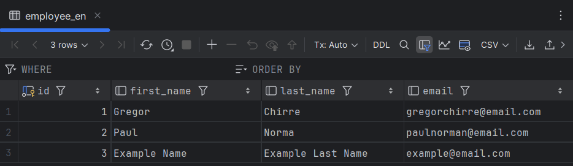

# Approach on how to create a localized application and database

### Goal was to create basic gui and app that saves data to specific database table depending on selected locale in dropdown menu.


### If English is selected, data is saved to english table


### Data is then saved to database table



---

# Main method
### Main method connects to database and starts the application.

```java
    public static void main(String[] args) {
        LocalizationConnection.connect();
        LocalizedController.launch(LocalizedController.class, args);
    }
```

---

# LocalizationConnection class
### LocalizationConnection class connects to database.

```java
    private static final String DB_URL = "jdbc:mysql://localhost:3306/localized_db";
    private static final String DB_USER = "root";
    private static final String DB_PASSWORD = "Password";
    private static int id = 0;
    private static Connection conn;
    private static String language;
```

### This method connects to database.

```java
    public static void connect() {
        try {
            conn = DriverManager.getConnection(DB_URL, DB_USER, DB_PASSWORD);
            System.out.println("Connected to the database");
        } catch (SQLException e) {
            e.printStackTrace();
        }
    }
```
### This method checks locale and saves data to correct sql table.

```java
    public static void saveData(String firstName, String lastName, String email) {
        
        System.out.println("Language selected");
        if (language_selector.getValue().equals("English")) {
            loadLanguage("en", "UK");
        } else if (language_selector.getValue().equals("Japanese")) {
            loadLanguage("ja", "JP");
        } /*
            and so on ...
        */
        
        System.out.println("Saving data...");
        id++;
        try (PreparedStatement stmt = conn.prepareStatement(sql)) {
            stmt.setString(1, firstName);
            stmt.setString(2, lastName);
            stmt.setString(3, email);
            stmt.executeUpdate();
            System.out.println("Data saved successfully");
        } catch (SQLException e) {
            e.printStackTrace();
        }
    }
```

---

# LocalizedController class
### LocalizedController class to control the GUI.

### Method to save data on Save button click.

```java
    @FXML
    protected void onSaveButtonClick() {
        SyslizationConnection.setLanguage(language_selector.getValue().toString());
        Localtem.out.println("Save button clicked");
        LocaizationConnection.saveData(first_name_input.getText(), last_name_input.getText(), email_input.getText());
}
```

### Method to call loadLanguage method on language selection dropdown menu.

```java
    @FXML
    protected void onLanguageSelection() {
        System.out.println("Language selected");
        if (language_selector.getValue().equals("English")) {
            loadLanguage("en", "UK");
        } else if (language_selector.getValue().equals("Japanese")) {
            loadLanguage("ja", "JP");
        } /*
            and so on ...
        */
    }
```

### Method to load language.

```java
    @FXML
    private void loadLanguage(String lang, String country) {
        locale = new Locale(lang, country);
        bundle = ResourceBundle.getBundle("translation", locale);
        select_language.setText(bundle.getString("select_language"));
        first_name.setText(bundle.getString("first_name"));
        last_name.setText(bundle.getString("last_name"));
        email.setText(bundle.getString("email"));
        save_button.setText(bundle.getString("save"));
}
```

---

# SQL script
### SQL script to create tables:

```sql
CREATE TABLE employee_en (
    id INT AUTO_INCREMENT PRIMARY KEY,
    first_name VARCHAR(50),
    last_name VARCHAR(50),
    email VARCHAR(100)
);

CREATE TABLE employee_fa (
    id INT AUTO_INCREMENT PRIMARY KEY,
    first_name VARCHAR(50),
    last_name VARCHAR(50),
    email VARCHAR(100)
);

CREATE TABLE employee_ja (
    id INT AUTO_INCREMENT PRIMARY KEY,
    first_name VARCHAR(50),
    last_name VARCHAR(50),
    email VARCHAR(100)
);

CREATE TABLE employee_fr (
    id INT AUTO_INCREMENT PRIMARY KEY,
    first_name VARCHAR(50),
    last_name VARCHAR(50),
    email VARCHAR(100)
);

CREATE TABLE employee_de (
    id INT AUTO_INCREMENT PRIMARY KEY,
    first_name VARCHAR(50),
    last_name VARCHAR(50),
    email VARCHAR(100)
);

CREATE TABLE employee_es (
    id INT AUTO_INCREMENT PRIMARY KEY,
    first_name VARCHAR(50),
    last_name VARCHAR(50),
    email VARCHAR(100)
);

CREATE TABLE employee_ru (
    id INT AUTO_INCREMENT PRIMARY KEY,
    first_name VARCHAR(50),
    last_name VARCHAR(50),
    email VARCHAR(100)
);

CREATE TABLE employee_sv (
    id INT AUTO_INCREMENT PRIMARY KEY,
    first_name VARCHAR(50),
    last_name VARCHAR(50),
    email VARCHAR(100)
);

CREATE TABLE employee_su (
    id INT AUTO_INCREMENT PRIMARY KEY,
    first_name VARCHAR(50),
    last_name VARCHAR(50),
    email VARCHAR(100)
);
```
